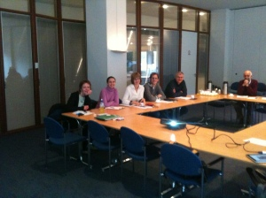

Source: [Think Links](\"http://thinklinks.wordpress.com/feed/\")

As a computer scientist, I’ve always found it inspirational talking to people from other disciplines. There are always interesting problems where computational techniques could be applied and also questions about what we would have to improve in order to use technology in these disciplines. I also know from talking to a range of people (biologists, communication scientists, etc) that they often feel excited about the opportunity to work with cutting edge computer science.

But even with excitement on both sides, it is hard to engage in interdisciplinary work. We are often pulled to our own communities for a variety of reasons (incentives, social structure, vocabulary…) and even when we do engage, it is often only for the length of one project. Afterwards, the collaboration dwindles.

The [VU (Vrije Universiteit Amsterdam)](http://thinklinks.wordpress.com/http//www.vu.nl) through the [Network Institute](http://www.networkinstitute.eu/) has been putting effort in trying to increase and extend interdisciplinary engagement. In June, Iina Hellsten and I organized a [half-day symposium](http://thinklinks.wordpress.com/2010/07/01/colliding-computer-social-sciences-at-the-vu/) for discussion about collaborations between social science and computer science. It was successful in two respects:

1. It generated excitement.
2. It identified a set of challenges and opportunities for collaboration.

We followed up this symposium two months later (Aug. 28, 2009) with a second meeting this time focused on turning this excitement into concrete initiatives. We had 13 participants this time again with attendees from both computer science and social science.

The meeting started by breaking into three groups where we spent about 40 minutes generating concrete collaboration ideas in the context of the [4 challenges and 4 opportunities identified at the last meeting](http://thinklinks.wordpress.com/2010/07/01/colliding-computer-social-sciences-at-the-vu/). We ensured that each group had members from computer science and social science. After that session each group presented their top 3 ideas. Groups were good at using the “technology”:

After this session, the group selected three areas of interest and then discussed how these could be concretely acted upon.

Here are the results:

**1\. Advertising collaborations**

One issue that came up was the difficulty in knowing what the other discipline was doing and whether collaboration would be helpful.

- _Announcement of talks on a central site._ Simply, if the agent simulation group in CS is having a talk perhaps the organization architectures social science group would want to know about it. We thought we could use the Network Institute Linked In Group for this.
- _Consulting._ I thought this was a fun idea… Here, one could advertise their willingness to spend 1/2, 1, or two days with a person from the other discipline advising and helping them out with no expectations on either side. For example, if a social scientist wanted to have help running a large scale analysis, a computer scientist could help for a day without expecting to have to continue to help. Likewise, a computer scientist wanting a social scientist to check if their paper on analyzing twitter was theoretically sound, the social scientist could spend a half day with them. It was proposed that the Network Institute could offer incentives for this.

**2\. Interdisciplinary master and PhD student projects.**  
Collaborating through students can provide a way to build longer lasting collaborations.

- One initiative would be to advertise c_o-supervised masters projects_ hopefully as soon as this November.
- Since PhD students usually require funding, it was felt there needs to be more collaboration on obtaining research funding between faculties. One challenge here is knowing what calls could be targeted. To attack this problem, we thought the subsidy desk at the VU could start a s_pecial email list for interdisciplinary calls_.

**3\. Processing large-scale data**  
Large scale data (from the web or otherwise) was of interest to a big chunk of the people in the room. There was a feeling that it would be nice to know what sorts of data sets people have or what data sets they were looking for.

- As a first step, we imagine a _structured event sometime in 2011_ where participants would present the data sets they have or what data sets they are looking for, and what analysis they aim to do. The aim of the event would be to try and build one-to-one connections across disciplines.

I think the group as a whole felt that these ideas could be straightforwardly put into practice and would lead to deeper and lasting collaborations between social and computer science. It would be great to hear your ideas along with comments and questions below.

  
Filed under: [academia](http://thinklinks.wordpress.com/category/academia/) Tagged: [collaboration](http://thinklinks.wordpress.com/tag/collaboration/), [computer science](http://thinklinks.wordpress.com/tag/computer-science/), [network institute](http://thinklinks.wordpress.com/tag/network-institute/), [social science](http://thinklinks.wordpress.com/tag/social-science/), [vu](http://thinklinks.wordpress.com/tag/vu/)        
