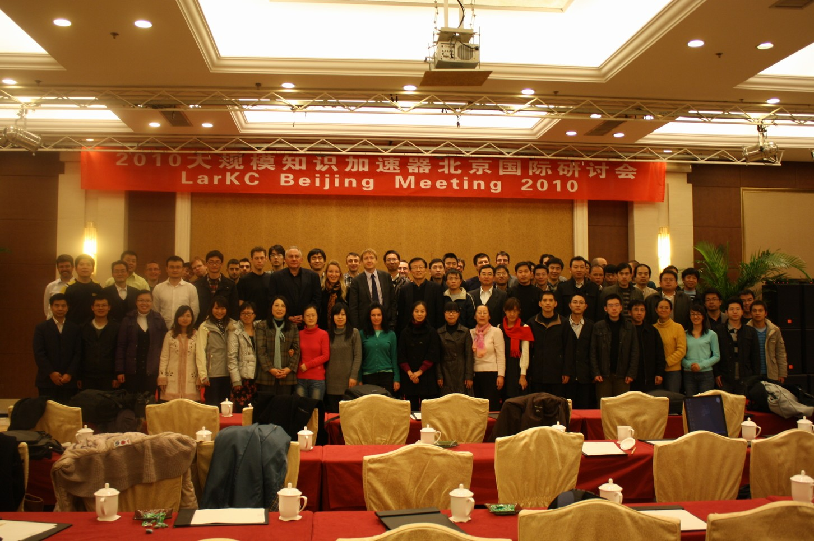

by [Yi Zeng](http://www.wici-lab.org/wici/~yizeng/)  
The 4th LarKC Early Adopters Tutorial took place in Beijing, China on Nov 13th, 2010. 

- [http://www.larkc.eu/2010/4th-early-adopters-tutorial/](http://www.larkc.eu/2010/4th-early-adopters-tutorial/)

- [http://www.wici-lab.org/wici/larkc/4eat/](http://www.wici-lab.org/wici/larkc/4eat/)

Approximately 90 participants attended the tutorial. 2 introductions, 4 hands on sessions as well as use cases demos from Urban computing has been given.The tutorial is in bi-lingual (English and Chinese), with most of the talks translated real-time to the audience.

The participants agreed that LarKC is easy to use as a plugable platform for Web-scale reasoning.The materials of the 4th LarKC Early Adopters Tutorial can be downloaded from the LarKC sourceforge and the following addresses:  

- \[Chinese version of the tutorial guide\]
- [http://www.wici-lab.org/wici/larkc/4eat/EAW\_final-Chinese.pdf](http://www.wici-lab.org/wici/larkc/4eat/EAW_final-Chinese.pdf)
- \[English version of the tutorial guide\]
- [http://www.wici-lab.org/wici/larkc/4eat/EAW\_handout.pdf](http://www.wici-lab.org/wici/larkc/4eat/EAW_handout.pdf)
- \[The tutorial software pack, including LarKC platform and workflows\]
- [http://www.wici-lab.org/wici/larkc/4eat/LarKC.rar](http://www.wici-lab.org/wici/larkc/4eat/LarKC.rar)
