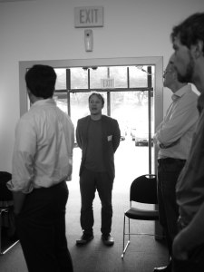

Source: [Semantic Web world for you](http://semweb4u.wordpress.com/feed/)

_[Wayan](http://www.olpcnews.com/mt/mt-cp.cgi?__mode=view&blog_id=4&username=wayan) recently [blogged about the project SemanticXO](http://www.olpcnews.com/software/applications/semanticxo_is_a_semantic_web_f.html), asking about its current status. Unfortunately, I couldn’t comment on his blog so I’d like to answer to his question here. [Daniel](http://www.dansdata.com/) also emitted some doubts about the [Semantic Web](http://semanticweb.org "Semantic Web"), so I’ll try to clarify what this is all about._

> To be honest, I’m not sure what that really means. Is this a database project? Is it to help translation of the [Sugar](http://wiki.sugarlabs.org/ "Sugar (desktop environment)") User Interface? Or are children somehow to use SemanticXO in their language acquisition?

Semantic technologies are knowledge representation tools used to model factual information – for instance, “Amsterdam,isIn,Netherlands”. These facts are stored in optimised databases called the triple stores. So, yes, it is kind of a data base project which aims at installing such a triple store and provide an [API](http://en.wikipedia.org/wiki/Application_programming_interface "Application programming interface") for using it. The technologies developed for the Semantic Web are particularly suited to storing and querying multi-lingual data, thus activities that need to store text in different languages would directly benefit from this feature. The triple store could indeed eventually be used instead of the .po files to store multi-lingual data for Sugar.

The goal of SemanticXO is not only to provide an API to use a triple store on the XO but also to provide access to the data published using Semantic Web technologies. There has been many data sets being published on the Web, providing a network with more than 27 Billion factual information that can be queried and combined. Although not being exhaustive, the [Linked Open Data (LOD) cloud](http://lod-cloud.net) provides a good idea of the amount of data out there. With SemanticXO an activity developer will be able to simply get the population of Amsterdam, or the exact location of Paris, or the population of London, or whatever. The LOD cloud can be queried just like a database and it contains a lot of information about many topics. And because the XO will itself be able to use the same publication system, the kids using Sugar will be able to publish their data on the cloud directly from an activity.

Currently, it is hard, if not impossible, to get such atomic information and just insert it somewhere into an activity with a few lines of code…

> Regardless of its purpose, it seems that SemanticXO development has come to a halt. The only other post from Christophe Guéret detailed [RedStore running on the XO](http://semweb4u.wordpress.com/2010/12/20/redstore-running-on-the-xo/), where he noted the challenges of installing a [TripleStore](http://en.wikipedia.org/wiki/Triplestore "Triplestore") on an XO using RedStore, namely that RedStore depends on some external libraries that are not yet packaged for Fedora11 and since it’s not so easy to compile directly on the XO, a second computer is required.

[This post](http://www.olpcnews.com/software/applications/semanticxo_is_a_semantic_web_f.html) was published on the 11 of April 2011. To date, there were three posts about SemanticXO: [the introduction](http://semweb4u.wordpress.com/2010/12/15/semantic-web-for-kids/) (posted on December 15, 2010), [the installation of a triple store](http://semweb4u.wordpress.com/2010/12/20/redstore-running-on-the-xo/) (posted on December 20, 2010) and a first activity using the triple store (posted on April 5, 2011). So there was one other post made since the installation of the triple store. But that first step of installing a triple store was indeed important for what I want to do with SemanticXO and it was not easy to find one that would fit the low specs of an [XO-1](http://en.wikipedia.org/wiki/OLPC_XO-1 "OLPC XO-1"). Then, the installation was a bit challenging because of the dependencies but nothing really exceptional there. Ideally, the triple store will come installed by default on the [OLPC](http://www.laptop.org "One Laptop Per Child") OS releases some day 

> Once installed, the XO didn’t return queries quickly. The XO failed on a number of benchmark different triple stores, even after being executed over a full night.

I was pleased, surprised and relieved to see that the triple store worked in the first place! From what I know, it was the first time a triple store was running on such low-spec hardware and I wanted to see how far I could push it. So I loaded a significant amount of triples (50k) and ran of the testing suite we typically use to test triple store performances. As expected, the response time was long and most complex queries just failed. But these evaluation systems are aimed at testing big triple stores on big hardware and the queries are designed to see how the triple store deal with extreme cases. Considering that on the oldest generation of XO the triple store managed to answer queries way more complex that the one it is expected to deal with, I found the results acceptable and decided to move onto the next steps.

> So Christophe, what does this mean? Is a Semantic Web for children using the XO possible?

Yes, it is possible and I’m still actively working on it! The developement is going slower than I would like it to go, as many contributors I work on this project on my spare time, but it is going on. The [last post](http://semweb4u.wordpress.com/2011/04/05/clustering-activity-for-the-xo/) on this blog shows an activity using the store for its internal data and contains a pointer to a [technical report](http://semweb4u.files.wordpress.com/2011/04/semanticxo_technical_report.pdf) that, I hope, will bring more light onto the project goals & status. Right now, I’m working on extending this activity and implementing an drop-in replacement for the data store that would use the triple store to store metadata about the different entries. This clustering activity is only showing how activities in Sugar can store data using the triple store so I’m also working on an activity that will show the other aspect: how the same concepts can be used to get data from the LOD cloud and display it.

> I have been able to detect no clear correlation between use of the term “Semantic Web” and knowledge of what it means. I think everybody just read it in Wired in 1999 and filed it away as a really good thing to put on a square of your Buzzword Bingo card.

Since 1999, and until some years ago, the Semantic Web has been searching for its own identity and meaning. It started out as a vision of having data being published on the Web just as the Web as we know it allows for the publication of Documents. Translating a vision into concrete technologies is a lengthy process subject of debates and trial&errors phases before you get into something everyone can see and play with. Now, we are getting on track with data sets being published on the Web using Semantic Web technologies ([the LOD cloud](http://lod-cloud.net), [Linked Open Commerce](http://linkedopencommerce.com/)), some dedicated high-end conferences ([ISWC](http://iswc2010.semanticweb.org/), [ESWC](http://www.eswc2010.org/), [SemTech](http://semtech2010.semanticuniverse.com/), …) and journals ([JWS](http://www.elsevier.com/wps/find/journaldescription.cws_home/671322/description#description), [SWJ](http://www.semantic-web-journal.net/), …). Outside of academia, there is also an increasing amount of Semantic Web application but most of it is invisible to the end user. Have you noticed [Facebook is using Semantic Web technologies](http://ogp.me/ "OpenGraph protocol") to mark up the pages for its famous “Like” button? Or that the NYTimes [uses the same technologies to tag its articles](http://open.blogs.nytimes.com/tag/semantic-web/)? and these are only two example [out of many more](http://www.slideshare.net/Frank.van.Harmelen/semantic-web-good-news).

As highlighted by [Tom Ilube](http://www.tomilube.blogspot.com/) from [Garlik](http://www.garlik.com/) (an other company using Semantic Web technology), the Semantic Web is a [change in the infrastructure of the Web itself that you won’t even see happening](http://www.youtube.com/watch?v=k_zoEeWOBuo).

###### Related Articles

- [Clustering activity for the XO](http://semweb4u.wordpress.com/2011/04/05/clustering-activity-for-the-xo/) (semweb4u.wordpress.com)
- [A Semantic Web Founding Father Explains Why Americans Should Care About Keeping Open Government Data Alive – semanticweb.com](http://semanticweb.com/a-semantic-web-founding-father-explains-why-americans-should-care-about-keeping-open-government-data-alive_b18929) (semanticweb.com)
- [Drupal May Be The First Mainstream Semantic Web Winner – semanticweb.com](http://semanticweb.com/drupal-may-be-the-first-mainstream-semantic-web-winner_b568) (semanticweb.com)
- [BBC Builders: Yves Raimond on the BBC’s interlinked, semantic web of the future](http://r.zemanta.com/?u=http%3A//www.guardian.co.uk/media/pda/2011/apr/06/bbc-yves-raimond&a=40195336&rid=00000118-ea6d-000F-0000-000000000097&e=3f93b1e0fa31bc3f1eaf5de69baa94ca) (guardian.co.uk)

  
       
