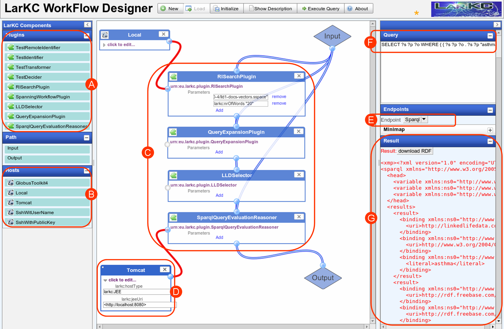

The LarKC development team is proud to announce the new release V2.5 of the LarKC platform. The new release is a considerable improvement over the previous V2.0 edition, with the following distinctive features:

- V2.5 is fully compliant with the LarKC final architecture. You can now develop your workflows and plugins, and be assured that future updates won’t change the main APIs.
- The Management Interface, which makes it possible to run LarKC from your browser, has an updated RESTful implementation. Besides RDF/XML, workflows can now be described in very readable N3 notation.
- The endpoint for submitting queries to LarKC is now user-definable, and multiple endpoints are supported.
- The Plug-in Registry has been improved, and is now coupled with the browser-based Management Interface
- LarKC now uses a Maven-based build system, giving improved version and dependency management, and a simplified procedure for new plug-in creation
- A number of extra tools have been introduced to make life for LarKC users a lot easier. Besides the Mangement Interface to run LarKC from your browser, V2.5 also contains:
    - A WYSIWIG Worfklow Designer tool that allows you to construct workflows by drag-and-drop, right from your browser: click on some plugins, drag them to the workspace, click to connect them, and press run! (see screenshot below).
    - An updated plug-in wizard for Eclipse.
- We have thouroughly updated the distributed execution framework. Besides deploying LarKC plugins through Apache (simply by dropping them in your Apache folder), it is now also possible to deploy plugins through JEE (for webservers) or GAT (for clusters).
- The WYSIWYG Workflow Designer allows you to specify remote execution of a plugin simply by connecting a plugin to a remote host. Templates are provided for such remote host declaration.
- LarKC now takes care of advanced data caching for plug-ins
- V2.5 comes with extended and improved JUnit tests
- Last but not least, we have considerably improved documentation and user manuals, including a quick-start guide, tutorial materials and example workflows.

The release can be downloaded from [http://sourceforge.net/projects/larkc/files/Release-2.5/larkc-release-2.5.zip/download](http://sourceforge.net/projects/larkc/files/Release-2.5/larkc-release-2.5.zip/download)  
The platform’s manual is available at [http://sourceforge.net/projects/larkc/files/Release-2.5/LarKC\_Platform\_Manual\_2.5.pdf/download](http://sourceforge.net/projects/larkc/files/Release-2.5/LarKC_Platform_Manual_2.5.pdf/download)

Bugs can be submitted using the bug tracker at [http://www.larkc.eu/bug-tracker](http://www.larkc.eu/bug-tracker/)

As usual, you are encouraged to use the discussion forums and mailing lists served by the [LarKC@SourceForge](mailto:LarKC@SourceForge) development environment.  
please see at [http://larkc.sourceforge.net/](http://larkc.sourceforge.net/)

