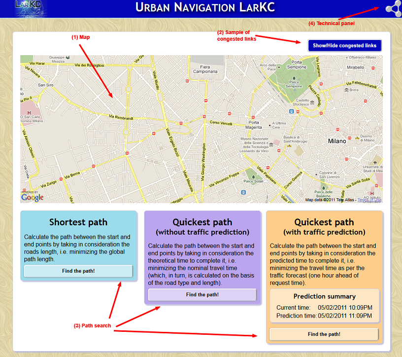

A LarKC workflow for traffic-aware route-planning has won the 1st prize in the [AI Mashup Challenge](https://sites.google.com/a/fh-hannover.de/aimashup11/) at the [ESWC 2011 conference](http://www.eswc2011.org/), held this week on Crete.

The detail of “Traffic\_LarKC” can be found at [https://sites.google.com/a/fh-hannover.de/aimashup11/home/traffic\_larkc](https://sites.google.com/a/fh-hannover.de/aimashup11/home/traffic_larkc), but in brief:

Four different datasets are used:

- the traffic sensors data, obtained from [Milano Municipality](http://www.ama-mi.it/)
- the Milano street topology
- historical weather data from the Italian website [ilMeteo.it](http://www.ilmeteo.it/)
- calendar information (week days and week-end days, holidays, etc.) from Milano Municipality and from the [Mozilla Calendar project](http://www.mozilla.org/projects/calendar/holidays.html).

These are used in a batchtime workflow to predict the traffic situation over the next two ours and in a runtime workflow to respond to route-planning queries from users.

- The demo can be found at [http://larkc.cefriel.it/traffic-larkc](http://larkc.cefriel.it/traffic-larkc),
- a video is at [http://larkc.cefriel.it/traffic-larkc/traffic-larkc-video.html](http://larkc.cefriel.it/traffic-larkc/traffic-larkc-video.html)
- a paper is at [https://sites.google.com/a/fh-hannover.de/aimashup11/home/traffic\_larkc/traffic-larkc2\_aimc-eswc-2011.pdf?attredirects=0&d=1](https://sites.google.com/a/fh-hannover.de/aimashup11/home/traffic_larkc/traffic-larkc2_aimc-eswc-2011.pdf?attredirects=0&d=1), and
- the competition entry is at [https://sites.google.com/a/fh-hannover.de/aimashup11/home/traffic\_larkc](https://sites.google.com/a/fh-hannover.de/aimashup11/home/traffic_larkc).

This LarKC workflow shows that Linked Open Data and the corresponding technologies are now getting good enough to compete with what’s possible in closed commercial systems.

Congratulations to the entire team that has made this possible!

