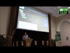

Source: [Think Links](http://thinklinks.wordpress.com/feed/)

The VU University Amsterdam computer science department has been a pioneer at putting structured data and Semantic Web into the undergraduate curriculum through our Web-based Knowledge Representation. I’ve had the pleasure of teaching the class for the past 3 years. The class is done in a short block of 8 weeks (7 weeks if you give them a week for exams). It’s a fairly complicated class for second year undergraduates but each year the technology becomes easier making it easier for the students to ground the concepts of KR and Web-based data into applications.

The class involves 6 lectures covering the major ground of Semantic Web technologies and KR. We then give them 3 1/2 weeks to design and hopefully build a Semantic Web application in pairs. During this time we give one-on-one support through appointments. For most students, this is the first time they’ve come into contact with Semantic Web technologies.

This year they built applications based on [The Times Higher Education 2011 World University rankings](http://www.timeshighereducation.co.uk/world-university-rankings/index.html). They converted databases to RDF, developed their own ontologies, integrated data from the linked data cloud and visualized data using sparql. I was impressed with all the work they did and I wanted to share some of their projects. Here are four screencasts from the applications the students built.

**Points of Interest Around Universities**

**Guess Which University**

**Find Universities by Location**

**SPARQL Query Builder for University Info**

  
Filed under: [academia](https://thinklinks.wordpress.com/category/academia/), [linked data](https://thinklinks.wordpress.com/category/linked-data/) Tagged: [education](https://thinklinks.wordpress.com/tag/education/), [linked data](https://thinklinks.wordpress.com/tag/linked-data/), [semantic web](https://thinklinks.wordpress.com/tag/semantic-web/), [student](https://thinklinks.wordpress.com/tag/student/), [vu university amsterdam](https://thinklinks.wordpress.com/tag/vu-university-amsterdam/), [web-based knowledge representation](https://thinklinks.wordpress.com/tag/web-based-knowledge-representation/)        
