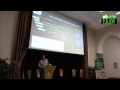

Source: [Think Links](http://thinklinks.wordpress.com/feed/)

A really great way to teach computer science without a computer – [Computer Science Unplugged](http://csunplugged.org/) . Thanks to [Lois Delcambre](http://web.cecs.pdx.edu/~lmd/) for the pointer.

  
Filed under: [academia](https://thinklinks.wordpress.com/category/academia/) Tagged: [computer science](https://thinklinks.wordpress.com/tag/computer-science/), [csunplugged](https://thinklinks.wordpress.com/tag/csunplugged/), [teaching](https://thinklinks.wordpress.com/tag/teaching/)        
