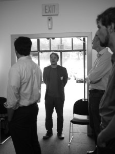

Source: [Think Links](http://thinklinks.wordpress.com/feed/)

From November 1 – 3, 2012, I attended the [PLOS Article Level Metrics Workshop](https://sites.google.com/site/altmetricsworkshop/) in San Francisco .

[PLOS](http://www.plos.org) is a major open-access online publisher and the publisher of the leading megajournal PLOS One. A mega-journal is one that accepts any scientifically sound manuscript. This means there is no decision on novelty just a decision on whether the paper was done in a scientifically sound way. The consequence is that this leads to much more science getting published and the corresponding need for even better filters and search systems for science.

As an online publisher, PLOS tracks many what are termed article level metrics – these metrics go beyond of traditional scientific citations and include things like page views, pdf downloads, mentions on twitter, etc. Article level metrics are to my mind altmetrics aggregated at the article level.

PLOS provides a comprehensive api to obtain these metrics and wants to encourage the broader adoption and usage of these metrics. Thus, they organized this workshop. There were a variety of people attending ([https://sites.google.com/site/altmetricsworkshop/attendees/attendee-bios](https://sites.google.com/site/altmetricsworkshop/attendees/attendee-bios)) from publishers (including open access ones and the traditional big ones), funders, librarians to technologists. I was a bit disappointed not to see more social scientists there but I think the push here has been primarily from the representative communities. The goal was to outline key challenges for altmetrics and then corresponding concrete actions that could place in the next 6 months that could help address these challenges. It was an unconference so no presentations and lots of discussion. I found it to be quite intense as we often broke up into small groups where one had to be fully engaged. The organizers are putting together a report that digests the work that was done. I’m excited to see the results.

 [ Thanks Ian Mulvany!](https://plus.google.com/photos/102755743034732738536/albums/5807181863066123265/5807185529653036002)

[

### Highlights

](https://plus.google.com/photos/102755743034732738536/albums/5807181863066123265/5807185529653036002)

- [Launch of the](https://plus.google.com/photos/102755743034732738536/albums/5807181863066123265/5807185529653036002) [PLOS Altmetrics Collection](http://www.ploscollections.org/article/browseIssue.action?issue=info%3Adoi%2F10.1371%2Fissue.pcol.v02.i19). This was really exciting for me as I was one of the organizers of getting this collection produced. Our editorial is [here](http://www.ploscollections.org/article/info%3Adoi%2F10.1371%2Fjournal.pone.0048753): This collection provides a nice home for future articles on altmetrics
- I was impressed about the availability of APIs. There are now several aggregators and good sources of altmetrics in just a bit of time. ImpactStory, almetric.com, plos alm apis, mendeley, figshare.com, microsoft academic search
- rOpenSci ([http://ropensci.org](http://ropensci.org/)) is a cool project that provides R apis to many of these alt metric and other sources for analyzing data
- There’s quite a bit of interest in services to do these metrics. For example, Plum Analytics ([http://www.plumanalytics.com](http://www.plumanalytics.com/)) has a test being done at the University of Pittsburgh. I also talked to other people who were getting interest in using these alternative impact measures and also heard a number of companies are now providing this sort of analytics service.
- I talked a lot to Mark Hahnel from Figshare.com about the Data2Semantics LinkItUp service. He is super excited about it and loved the demo. I’m really excited about this collaboration.
- Microsoft Academic Search is getting better, they are really turning it into a production product with better and more comprehensive data. I’m expecting a really solid service in the next couple of months.
- I learned from [Ian Mulvany](http://www.mendeley.com/profiles/ian-mulvany/) of eLife that Graph theory is mathematically “the same as” statistical mechanics in physics.
- Context, Context, Context – there was a ton of discussion about the importance of context to the numbers one gets from altmetrics. For example, being able to quickly compare to some baseline or by knowing the population which the number is applied.
    
    
    
    White board thoughts on context! thanks Ian Mulvany
    
- Related to context was the need for simple semantics – there was a notion that for example we need to know if a retweet in twitter was positive or negative and what kind of person retweeted the paper (i.e. a scientists, a member of the public, a journalist, etc). This was because that unlike citations the population that altmetrics uses is not as clearly defined as it exists in a communication medium that doesn’t just contain scholarly communication.
- I had a nice discussion with Elizabeth Iorns the founder of [https://www.scienceexchange.com](https://www.scienceexchange.com/) . There doing cool stuff around building markets for performing and replicating experiments.
- Independent of the conference, I met up with some people I know from the natural language processing community and one of the things that they were excited about is computational semantics but using statistical approaches. It seems like this is very hot in that community and something we in the knowledge representation & reasoning community should pay attention to.

### Hackathon

Associated with the workshop was a hackathon held at the PLOS offices. I worked in a group that built a quick demo called [rerank.it](http://www.rerank.it) . This was a bookmarklet that would highlight papers in pubmed search results based on their online impact according to impact story. So you would get different color coded results based on alt metric scores. This only took a day’s worth of work and really showed to me how far these apis have come in allowing applications to be built. It was a fun environment and was really impressed with the other work that came out.

### Random thought on San Francisco

- [Four Barrel coffee](http://fourbarrelcoffee.com) serves really really nice coffee – but get there early before the influx of ultra cool locals
- The guys at [Goody Cafe](http://www.yelp.com/biz/goody-cafe-san-francisco) are really nice and also serve good coffee
- If you’re in the touristy Fisherman’s Wharf area walk to the Fort Mason for fantastic views of the golden gate bridge. The hostel there also looks cool.

  
Filed under: [altmetrics](http://thinklinks.wordpress.com/category/altmetrics-2/), [interdisciplinary research](http://thinklinks.wordpress.com/category/interdisciplinary-research/) Tagged: [#altmetrics](http://thinklinks.wordpress.com/tag/altmetrics/), [plos](http://thinklinks.wordpress.com/tag/plos/), [trip report](http://thinklinks.wordpress.com/tag/trip-report/)  
