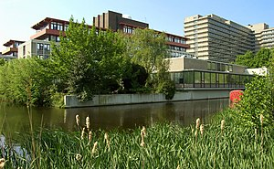

Source: [Data2Semantics](http://www.data2semantics.org/feed/)

VU University Amsterdam (Photo credit: Wikipedia)

**Learn to build better code in less time.**

Software Carpentry ([http://www.software-carpentry.org](http://www.software-carpentry.org)) is a two day bootcamp for researchers to learn how to be more productive with code and software creation. VU University Amsterdam brings Software Carpentry to the Netherlands for the first time. PhD students, postdocs and researchers in physics are cordially invited for this free, 2-day workshop, on **May 2–3, 2013**, in Amsterdam.

Data2Semantics is sponsoring the event to help learn the issues facing scientists around managing their data.

Go to [http://www.data2semantics.org/bootcamp](http://www.data2semantics.org/bootcamp) for more information and [registration](http://www.data2semantics.org/bootcamp/register.html) (max. 40!) .

