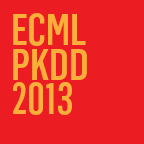

Source: [Data2Semantics](http://www.data2semantics.org/feed/)

Our [website with additional material](http://www.data2semantics.org/publications/ecmlpkdd-2013/ "ECML/PKDD 2013") for our paper: “[A Fast Approximation of the Weisfeiler-Lehman Graph Kernel for RDF Data](http://link.springer.com/chapter/10.1007/978-3-642-40988-2_39)” has won the [Open Science Award](http://www.ecmlpkdd2013.org/open-science-award/) at [ECML/PKDD 2013](http://www.ecmlpkdd2013.org/). The jury praised the submission as “a perfect example of open science”.

A goal of the Data2Semantics project is to provide resuable software to support semantic enrichment of data. Therefore, the software used for the paper uses existing well-known libraries ([SESAME](http://www.openrdf.org/), [LibSVM](http://www.csie.ntu.edu.tw/~cjlin/libsvm/)) and was set up into three distinct projects from the start. The heart of software is the [proppred](https://github.com/Data2Semantics/d2s-tools/tree/master/proppred) library, which contains all the code for doing property prediction using graph kernels on RDF data. Some additional support code for handling RDF is in the [d2s-tools](https://github.com/Data2Semantics/d2s-tools/tree/master/d2s-tools) project. All the code to run the experiments from the paper(s) is in a separate project called [kernelexperiments](https://github.com/Data2Semantics/d2s-tools/tree/master/kernelexperiments). This setup allows for easy replication of the (and doing new) experiments and easier integration of the property prediction on RDF library into other projects.

For the future, we aim to provide even more scientific openess via the [experimental machine learning platform](https://github.com/Data2Semantics/d2s-tools/tree/master/d2s-platform) that we are developing. One of the aims of the platform is to make experimentation easier, without introducing too much overhead. Furthermore, we wil export provenance of the experiments in the [Prov-O](http://www.w3.org/TR/2013/NOTE-prov-primer-20130430/) format. This provenance is visualized using [Prov-O-Viz](https://github.com/Data2Semantics/provoviz) (also developed in Data2Semantics), allowing researchers to gain better insight into the experiments without having to study the code.
