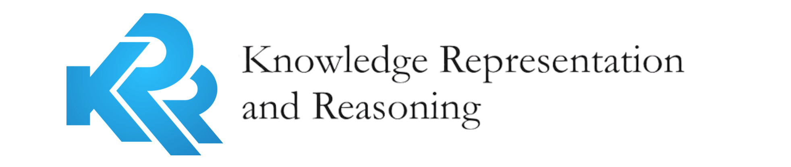

---
# Feel free to add content and custom Front Matter to this file.
# To modify the layout, see https://jekyllrb.com/docs/themes/#overriding-theme-defaults

layout: page
---
<!-- wp:paragraph {"fontSize":"medium"} -->

The&nbsp;<strong>KR&amp;R</strong> group at the VU existed from 1996 until 2022 and investigated modelling and representation of different forms of knowledge and reasoning, as found in a large variety of <a href="http://en.wikipedia.org/wiki/Artificial_intelligence">AI</a> systems. 

<!-- /wp:paragraph -->

<!-- wp:paragraph {"fontSize":"medium"} -->

From 2022 onward, its activities are continued in two closely collaborating groups at the Vrije Universiteit Amsterdam.

<!-- /wp:paragraph -->

<!-- wp:columns -->

<!-- wp:column -->

<!-- wp:paragraph {"fontSize":"large"} -->

Knowledge in AI 

<!-- /wp:paragraph -->

<!-- wp:paragraph -->

<a href="https://kai.cs.vu.nl/">https://kai.cs.vu.nl/</a>

<!-- /wp:paragraph -->

<!-- wp:quote -->
<blockquote class="wp-block-quote">
The mission of the KAI group is to contribute to a better understanding of the representation, acquisition, extraction and management of explicitly modeled knowledge and to facilitate and promote the usage of such knowledge in artificial intelligent agents.
</blockquote>
<!-- /wp:quote -->

<!-- /wp:column -->

<!-- wp:column -->

<!-- wp:paragraph {"fontSize":"large"} -->

Learning and Reasoning

<!-- /wp:paragraph -->

<!-- wp:paragraph -->

<a href="https://lr.cs.vu.nl/">https://lr.cs.vu.nl/</a>

<!-- /wp:paragraph -->

<!-- wp:quote -->
<blockquote class="wp-block-quote">
We study the ways machine learning, symbolic knowledge and formal reasoning can interact to enhance one another, based on the premise that inductive data-driven learning and deductive knowledge-based reasoning have complementary strengths and weaknesses.
</blockquote>
<!-- /wp:quote -->

<!-- wp:paragraph -->

 

<!-- /wp:paragraph -->

<!-- /wp:column -->

<!-- /wp:columns -->

<!-- wp:core-embed/youtube {"url":"https://www.youtube.com/watch?v=luVrbCV1OeE\u0026ab_channel=AccountDeleted","type":"video","providerNameSlug":"youtube","align":"center","className":"wp-embed-aspect-16-9 wp-has-aspect-ratio"} -->
<!-- <figure class="wp-block-embed-youtube aligncenter wp-block-embed is-type-video is-provider-youtube wp-embed-aspect-16-9 wp-has-aspect-ratio">

https://www.youtube.com/watch?v=luVrbCV1OeE&amp;ab_channel=AccountDeleted

</figure> -->
<!-- /wp:core-embed/youtube -->

<iframe width="560" height="315" src="https://www.youtube.com/embed/luVrbCV1OeE?si=__rPPWe1OHerP7k0" title="YouTube video player" frameborder="0" allow="accelerometer; autoplay; clipboard-write; encrypted-media; gyroscope; picture-in-picture; web-share" allowfullscreen></iframe>